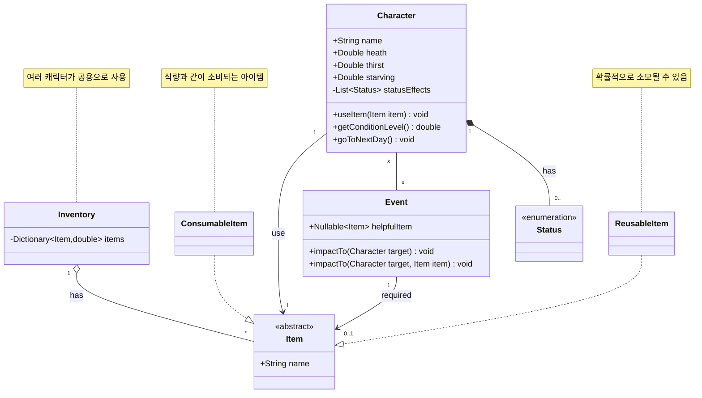
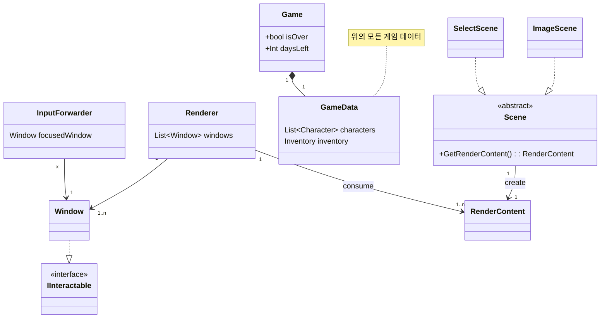

# KGA_OOPConsoleProject

## 컨셉 [60 seconds](https://ko.wikipedia.org/wiki/60%EC%B4%88!)   
<table>
<tr>
<td>

</td>
<td>
《60초!》는 스튜디오 Robot Gentleman에서 개발 및 출판한 액션 어드벤처 비디오 게임이다.   
그것은을 위해 출시 된 윈도우 2015년 5월 15일 2017년 12월 18일에 닌텐도 스위치과 2020년 3월 6일에 대한 플레이 스테이션 4와 엑스박스 원.   
이 게임은 60초 후에 핵폭탄 이 폭발하도록 설정되어 있는 교외 마을에서 진행되며, 4인 가족이 정해진 시간 내에 최대한 많은 보급품을 모은다.   
</td>
</tr>
</table>
- 선택이유: 동적인 화면이 많이 필요하지 않고 사용자의 선택에 따라 다양한 상황으로 흘러갈 수 있어 콘솔에서 플레이하기에 적합하다고 생각됨

## 필수 backlog   
#### 진행 순서   
	1. 게임 타이틀
	2. 게임 시작시 여러가지 아이템을 선택 (원작은 60초 제한이지만 async를 사용하지 않기 위해 시간 제한 없이 개수로 제한)   
	3. 장면을 전환해 기본적인 캐릭터 상태, 이벤트를 보여주는 화면 (하루가 지날 때마다 이 화면으로 이동)   
	4. 주어진 상황을 사용자에게 설명하고 사용자의 선택지를 제시
	5. 사용자의 선택을 입력 받고 다음 일로 진행   
	6. 정해진 날, 조건이 끝날 경우에는 게임 종료 후 결과 출력   
       게임이 종료하지 않으면 3으로 이동 후 진행   

#### 기능   
  - [ ] 상황에 따른 다음 장면으로 전환   
  - [ ] 게임의 종료 조건 판별   
  - [ ] 각 캐릭터의 상태를 관리   
  - [ ] 소지 아이템 관리   
  - [ ] 아이템의 사용
  - [ ] 특정 대상을 강조해 보여주는 기능 (타이틀, 아이템, 캐릭터 등)   
  - [ ] 사용자에게 상황, 이벤트를 글로 설명   
  - [ ] 사용자에게 선택지를 제시하고 입력을 받는 기능  
  - [ ] 사용자의 선택에 따라 게임의 데이터를 처리
## 추가 backlog
#### 진행에 관한 변경   
  - [ ] 게임 시작시 아이템을 고르는 맵을 제공, 시간 대신 걸음 수로 이동 제한   
  - [ ] 이벤트 발생시 동적인 캐릭터 컨트롤 및 화면   
  - [ ] 캐릭터가 죽는 화면   
#### 기능 추가  
  - [ ] 메인 화면과 별개로 캐릭터의 정보 표시   
  - [ ] 메인 화면과 별개로 소지 아이템 표시   
  - [ ] 현재 캐릭터와 소지한 아이템에 따른 이벤트 발생   
  - [ ] 캐릭터의 상태에 따른 이벤트 발생   
## diagram
#### game data diagram

#### game system diagram

