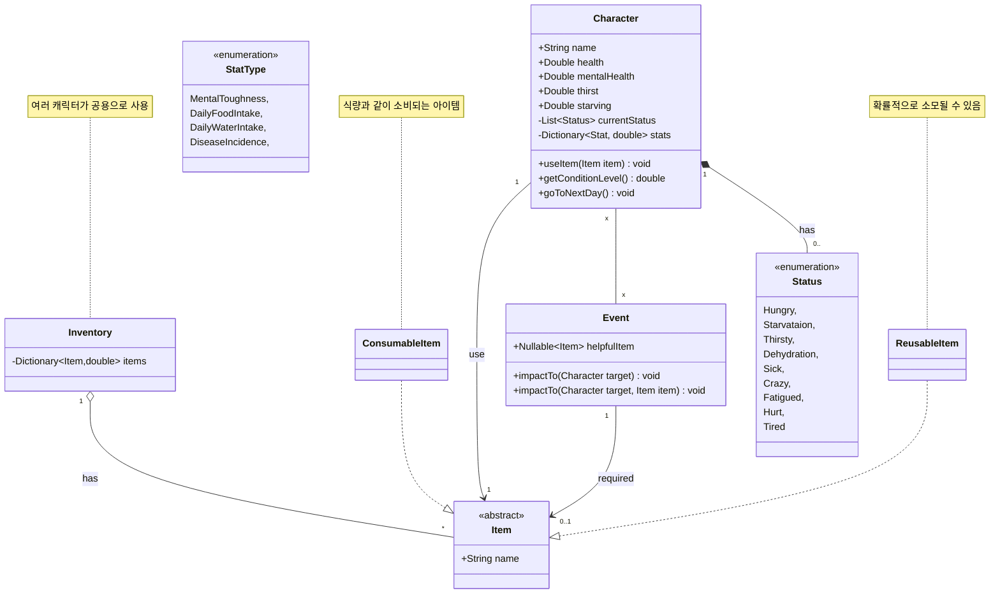
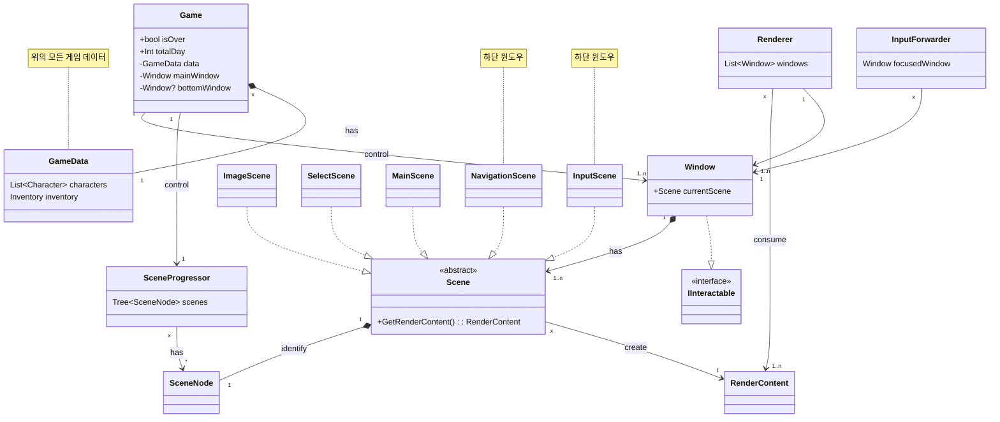

# KGA_OOPConsoleProject

## 컨셉 [60 seconds](https://ko.wikipedia.org/wiki/60%EC%B4%88!)   
<table>
<tr>
<td>

</td>
<td>
《60초!》는 스튜디오 Robot Gentleman에서 개발 및 출판한 액션 어드벤처 비디오 게임이다.   
그것은을 위해 출시 된 윈도우 2015년 5월 15일 2017년 12월 18일에 닌텐도 스위치과 2020년 3월 6일에 대한 플레이 스테이션 4와 엑스박스 원.   
이 게임은 60초 후에 핵폭탄 이 폭발하도록 설정되어 있는 교외 마을에서 진행되며, 4인 가족이 정해진 시간 내에 최대한 많은 보급품을 모은다.   
</td>
</tr>
</table>
- 선택이유: 동적인 화면이 많이 필요하지 않고 사용자의 선택에 따라 다양한 상황으로 흘러갈 수 있어 콘솔에서 플레이하기에 적합하다고 생각됨

## 필수 backlog   
#### 진행 순서   
	1. 게임 타이틀 (✅)
	2. 캐릭터 선택 (✅)
	3. 여러가지 아이템을 선택 (원작은 60초 제한이지만 async를 사용하지 않기 위해 시간 제한 없이 개수로 제한)  (✅)
	4. 장면을 전환해 기본적인 캐릭터 상태, 이벤트를 보여주는 화면 (하루가 지날 때마다 이 화면으로 이동)   
	5. 주어진 상황을 사용자에게 설명하고 사용자의 선택지를 제시
	6. 사용자의 선택을 입력 받고 다음 일로 진행   
	7. 정해진 날, 조건이 끝날 경우에는 게임 종료 후 결과 출력   
       게임이 종료하지 않으면 3으로 이동 후 진행   

#### 기능   
  - [x] 상황에 따른 다음 장면으로 전환   
  - [x] 게임의 종료 조건 판별   
  - [x] 각 캐릭터의 상태를 관리   
  - [x] 소지 아이템 관리   
  - [x] 아이템의 사용
  - [x] 특정 대상을 강조해 보여주는 기능 (타이틀, 아이템, 캐릭터 등)   
  - [x] 사용자에게 상황, 이벤트를 글로 설명   
  - [x] 사용자에게 선택지를 제시하고 입력을 받는 기능  
  - [x] 사용자의 선택에 따라 게임의 데이터를 처리
## 추가 backlog
#### 진행에 관한 변경   
  - [ ] 게임 시작시 아이템을 고르는 맵을 제공, 시간 대신 걸음 수로 이동 제한   
  - [ ] 이벤트 발생시 동적인 캐릭터 컨트롤 및 화면   
  - [ ] 캐릭터가 죽는 화면   
#### 기능 추가  
  - [x] 메인 화면과 별개로 캐릭터의 정보 표시   
  - [x] 메인 화면과 별개로 소지 아이템 표시   
  - [ ] 현재 캐릭터와 소지한 아이템에 따른 이벤트 발생   
  - [ ] 캐릭터의 상태에 따른 이벤트 발생   
## diagram
#### game data diagram

#### game system diagram

